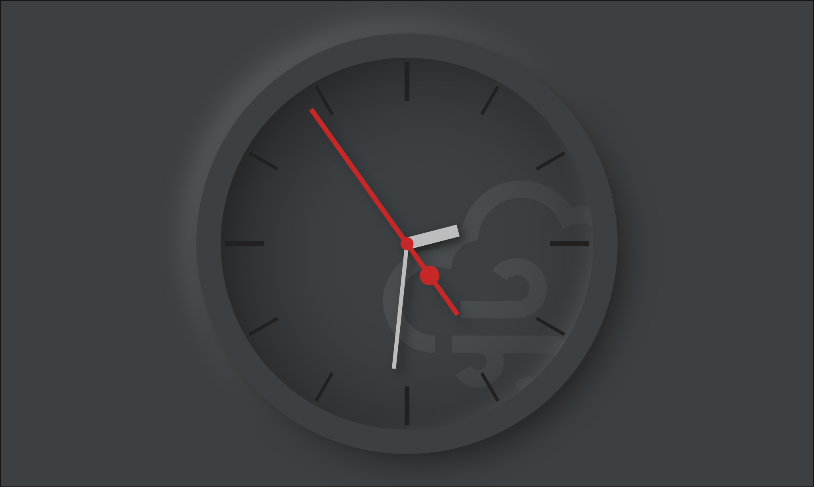

# Analog Clock

This clock face was inspired by neumorphic design. The main goal during development was simplicity and attention to details.

Clock face's hands are sublty animated and have slight drop shadow that is always oriented in the same direction. Bevels of the clock cast slight shadows the same way.

This clock face was prepared to work both in light and dark mode.

A small touch is a collection of icons depicting current weather conditions in the background of the clock face. The icons used are [LineIcons](https://lineicons.com/). The change of weather condition is animated with slide and fade animation.

